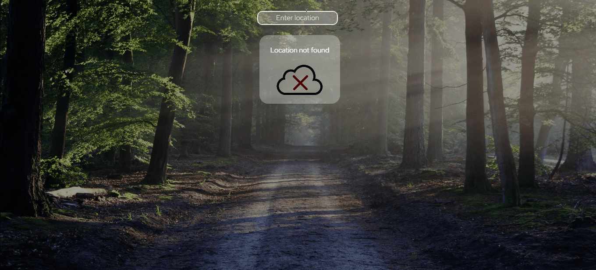

##  Simple Weather App Website

 Made by Klaudia Kępka

##  Simple Weather App Demo Website:
[Simple Weather App Demo Website](https://kepkaklaudia.github.io/simple-weather-app/)

##  Quick Preview

## Input field
In the field at the top of the page, you can enter the city where you want to check the weather conditions.

## Loading status
After entering the city name, we will see an animated data loading status.

## Weather data
Then the weather data will appear on the screen. 
At the top we can read the entered city and the country in which it is located. The corresponding icon for the weather status and its brief description will also be displayed. Weather details section includes the current temperature, feels like temperature, humidity, percentage of cloud cover, wind speed, pressure and time of sunrise and sunset.

## Responsive version
The application adapts to the dimensions of the screen. The data is displayed correctly on both tablets and mobile phones.

## API Data
Weather data are taken from [OpenWeather Website](https://openweathermap.org/).

If the application fails to download data from the API, the user will be shown the appropriate information about the failure.

# Getting Started with Create React App

This project was bootstrapped with [Create React App](https://github.com/facebook/create-react-app).

## Available Scripts

In the project directory, you can run:

### `npm start`

Runs the app in the development mode.\
Open [http://localhost:3000](http://localhost:3000) to view it in your browser.

The page will reload when you make changes.\
You may also see any lint errors in the console.

## Technologies used
     

   